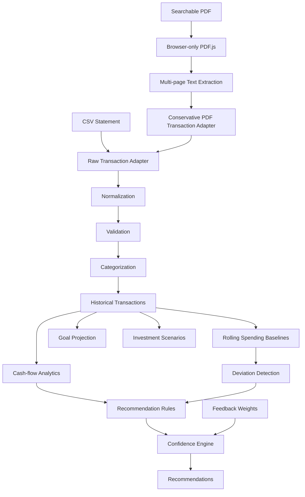

# Wealth Compass

> Personal-finance analytics application for transforming statement data into structured cash-flow insights, spending baselines, deviation alerts, financial-goal projections, and adaptive recommendation signals.

[](https://github.com/PerpsAkach/wealth-compass/actions/workflows/ci.yml)
[](https://perpsakach.github.io/)


## Overview

Wealth Compass is designed to answer questions that raw financial statements do not answer directly:

- Where is money going over time?
- Is current spending materially different from recent behavior?
- Is monthly cash flow improving or deteriorating?
- What contribution is required to reach a financial goal?
- How do investment scenarios change under different return assumptions?
- Which recommendation signals are strongly supported by available data?

The project separates **statement ingestion**, **transaction normalization**, **financial analytics**, and **recommendation logic** so each layer can evolve independently.

## Runnable browser demo

The Vite browser UI currently supports:

- uploading a CSV statement;
- uploading a **searchable-text PDF** statement;
- loading an included fictional sample dataset bundled with the application;
- transaction normalization and categorization;
- monthly income, expense, net-cash-flow, and observed-margin summaries;
- recommendation signals generated by the analytics pipeline;
- normalized transaction review.

PDF support is deliberately conservative. PDF.js performs browser-side searchable-text extraction and a generic adapter recognizes a documented transaction pattern. It does **not** perform OCR and is not presented as a universal parser for every institution's statement layout.

See [`docs/INPUT_FORMATS.md`](docs/INPUT_FORMATS.md) for the accepted CSV aliases, amount conventions, PDF pattern, date handling, and privacy boundary.

## What this project demonstrates

- TypeScript application architecture
- CSV and searchable-PDF statement ingestion
- browser-only PDF.js initialization and worker loading
- transaction normalization and categorization
- strict calendar-date validation
- monthly income / spending / cash-flow analytics
- robust historical spending baselines
- spending-deviation detection
- savings and goal modeling
- investment scenario comparisons
- recommendation confidence
- adaptive `Helpful` / `Not Relevant` feedback weighting
- runtime-boundary debugging
- deterministic npm installs and CI validation

## Architecture



## Notable engineering case study: PDF.js / `DOMMatrix`

An important defect occurred when the PDF-processing dependency was initialized in a non-browser runtime. The library expected browser primitives such as `DOMMatrix`, which were unavailable on the server.

The fix was architectural rather than cosmetic:

```text
Before
Server/shared module -> PDF.js -> DOMMatrix unavailable -> runtime failure

After
Browser action -> dynamic PDF.js import -> text extraction -> shared analytics
```

The current PDF extraction module explicitly checks for a browser environment, dynamically imports PDF.js only when browser primitives are available, and lets Vite resolve the PDF worker asset.

## Analytics model

### Monthly cash flow

```text
Net Cash Flow = Income - Expenses
```

When income is positive:

```text
Observed Cash-flow Margin = Net Cash Flow / Income
```

### Historical spending baseline

The reconstructed implementation uses a robust category-level baseline based on the median and median absolute deviation (MAD):

```text
Median_c = median(monthly spending in category c)
MAD_c    = median(|x - Median_c|)
```

A robust deviation score is then used to flag unusually high or low spending without allowing a single extreme month to dominate the baseline.

## Engineering verification

GitHub Actions validates the repository on Node.js 24 using the committed npm lockfile. The CI path performs:

```text
npm ci
npm audit --audit-level=moderate
npm test
npm run build
```

The build command runs TypeScript type-checking before Vite's production bundle. Test coverage includes ingestion, normalization, PDF transaction parsing, deviation analysis, goal and investment calculations, recommendation-feedback weighting, and an ingestion-to-analysis integration path.

## Current repository structure

```text
.github/workflows/ci.yml  # deterministic CI validation
docs/INPUT_FORMATS.md     # statement input contract
index.html                # Vite browser entry point
package-lock.json         # deterministic dependency resolution
package.json
vite.config.ts            # browser build configuration
sample_data/              # fictional CSV demonstration data
src/
├── main.ts               # browser demo orchestration
├── domain/               # transaction, goal, recommendation models
├── ingestion/            # CSV and browser-PDF adapters
├── analytics/            # cash flow, baselines, deviations, goals
├── coach/                # rules, confidence, recommendations, feedback
├── ui/                   # demo styling
└── pipeline.ts           # end-to-end analysis orchestration

tests/                    # unit and integration tests
```

## Quick start

Use a current Node.js runtime and install the exact dependency graph from the lockfile:

```bash
npm ci
npm run dev
```

Run tests:

```bash
npm test
```

Build:

```bash
npm run build
```

## Financial-safety scope

Wealth Compass is a **personal financial analytics and planning application**, not a bank, broker, tax preparer, or autonomous investment adviser.

Investment calculations are scenario projections based on caller-supplied return assumptions; they are not guaranteed forecasts.

For signed CSV `amount` fields, the demo assumes positive values are income and negative values are expenses. Institution-specific production adapters would need to encode each provider's actual sign convention.

## Privacy / security considerations

The public demo processes uploaded statement content in the browser; it does not connect to a bank or brokerage. A production system handling real financial data would require stronger controls, including:

- authentication and authorization;
- encryption at rest and in transit;
- secure secrets management;
- protected backups;
- deletion and retention controls;
- duplicate/transfer/refund reconciliation;
- sensitive logging restrictions;
- institution-specific parser validation and monitoring.

Use fictional or sanitized data when evaluating the public portfolio implementation.

## Current limitations

- PDF ingestion requires searchable text; OCR for scanned/image-only statements is not implemented;
- the generic PDF transaction adapter will not recognize every institution's layout;
- goal and investment modeling exist in the analytics library but are not all exposed as interactive browser controls;
- persistence is not presented as production-grade financial storage;
- there is no bank-account connection or live financial-data integration;
- recommendation outputs are analytical signals, not regulated financial advice.

## Provenance

This repository uses explicit provenance labels:

- **RECOVERED** — established from prior project work;
- **RECONSTRUCTED** — faithfully rebuilt where literal historical source bytes were unavailable;
- **ENHANCED** — modern portfolio-quality engineering additions;
- **UNVERIFIED** — not presented as historical fact without supporting evidence.

See [`PROVENANCE.md`](PROVENANCE.md) for the detailed register.

## Portfolio

Explore the complete project portfolio at **[perpsakach.github.io](https://perpsakach.github.io/)**.
