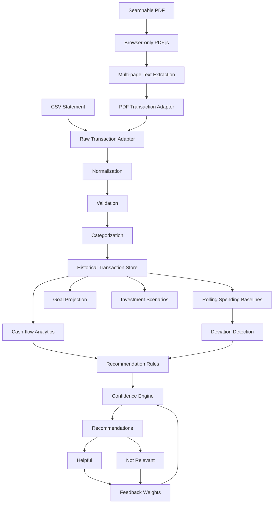

# Wealth Compass

> Personal-finance analytics application for transforming statement data into structured cash-flow insights, spending baselines, deviation alerts, financial-goal projections, and adaptive recommendations.

[](https://perpsakach.github.io/)


## Overview

Wealth Compass is designed to answer questions that raw bank statements do not answer directly:

- Where is money going over time?
- Is current spending materially different from recent behavior?
- Is monthly cash flow improving or deteriorating?
- What contribution is required to reach a financial goal?
- How do investment scenarios change under different return assumptions?
- Which recommendations are strongly supported by available data?

The application separates **document ingestion**, **financial analytics**, and **recommendation logic** so each layer can evolve independently.

## What this project demonstrates

- TypeScript application architecture
- CSV and searchable-PDF ingestion
- browser-only PDF.js processing
- transaction normalization and categorization
- monthly income / spending / cash-flow analytics
- robust historical spending baselines
- spending-deviation detection
- savings and goal modeling
- investment scenario comparisons
- recommendation confidence
- adaptive `Helpful` / `Not Relevant` feedback weighting
- runtime-boundary debugging

## Architecture



## Notable engineering case study: PDF.js / `DOMMatrix`

An important defect occurred when the PDF-processing dependency was initialized in a non-browser runtime. The library expected browser primitives such as `DOMMatrix`, which were unavailable on the server.

The fix was architectural rather than cosmetic:

```text
Before
Server/shared module -> PDF.js -> DOMMatrix unavailable -> runtime failure

After
Browser action -> dynamic PDF.js import -> text extraction -> shared analytics
```

This repository keeps PDF.js behind a browser-only boundary and passes plain extracted text into platform-independent parsing and analytics code.

## Analytics model

### Monthly cash flow

```text
Net Cash Flow = Income - Expenses
```

When income is positive:

```text
Observed Cash-flow Margin = Net Cash Flow / Income
```

### Historical spending baseline

The reconstructed implementation uses a robust category-level baseline based on the median and median absolute deviation (MAD):

```text
Median_c = median(monthly spending in category c)
MAD_c    = median(|x - Median_c|)
```

A robust deviation score is then used to flag unusually high or low spending without allowing a single extreme month to dominate the baseline.

## Adaptive recommendation layer

```text
Historical behavior
      ↓
Baseline
      ↓
Deviation / cash-flow signal
      ↓
Recommendation candidate
      ↓
Confidence
      ↓
Helpful / Not Relevant
      ↓
Future recommendation weighting
```

Feedback adjusts bounded recommendation weighting rather than allowing the application to rewrite its core financial rules autonomously.

## Repository structure

```text
src/
├── domain/       # Transaction, goal, recommendation models
├── ingestion/    # CSV and browser-PDF adapters
├── analytics/    # Cash flow, baselines, deviations, goals
├── coach/        # Rules, confidence, recommendations, feedback
├── storage/      # Persistence abstraction
└── pipeline.ts   # End-to-end analysis orchestration

tests/            # Domain and analytics tests
docs/             # Architecture, postmortem, data contract, security notes
sample_data/      # Fictional demonstration data
```

## Quick start

```bash
npm install
npm test
npm run dev
```

## Financial-safety scope

Wealth Compass is a **personal financial analytics and planning application**, not a bank, broker, tax preparer, or autonomous investment adviser.

Investment calculations are scenario projections based on caller-supplied return assumptions; they are not guaranteed forecasts.

## Privacy / security considerations

A production version would require stronger controls than the demonstration persistence layer, including:

- authentication and authorization
- encryption at rest and in transit
- secure secrets management
- protected backups
- deletion and retention controls
- duplicate/transfer/refund reconciliation
- sensitive logging restrictions

## Provenance

This repository uses explicit provenance labels:

- **RECOVERED** — established from prior project work
- **RECONSTRUCTED** — faithfully rebuilt where literal historical source bytes were unavailable
- **ENHANCED** — modern portfolio-quality engineering additions
- **UNVERIFIED** — not presented as historical fact without supporting evidence

See [`PROVENANCE.md`](PROVENANCE.md) for the detailed register.

## Portfolio

Explore the complete project portfolio at **[perpsakach.github.io](https://perpsakach.github.io/)**.